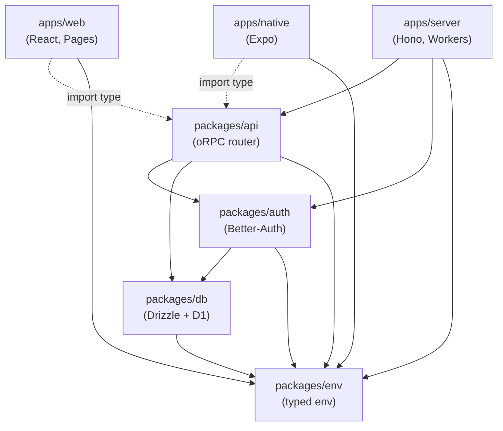
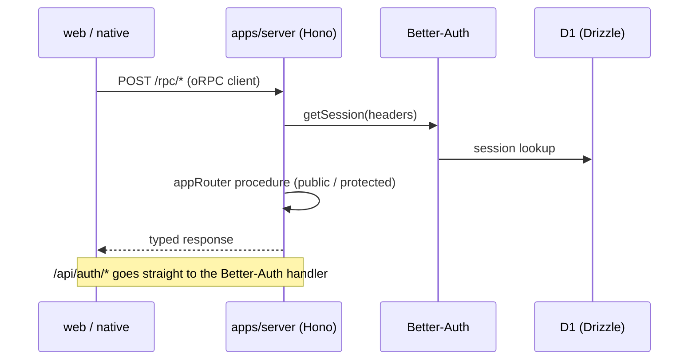
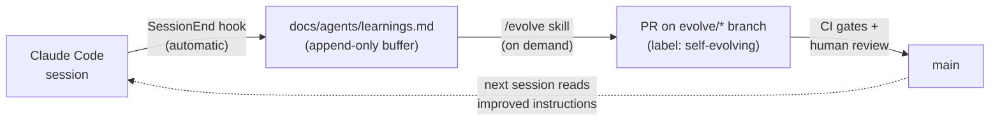

# han-monorepo-template

A full-stack TypeScript monorepo template: **React (web) + Expo (native) + Hono on Cloudflare Workers (API)**, sharing one type-safe oRPC contract end to end. Originally scaffolded with [Better-T-Stack](https://github.com/AmanVarshney01/create-better-t-stack), then extended with a unified toolchain, i18n, architecture lint, a testing-trophy test suite, and a **self-evolving AI pipeline** — the coding agent improves its own instructions and skills through gated PRs (see [Self-Evolving AI](#self-evolving-ai)).

## Stack

| Area                 | Choice                                                                                                       |
| -------------------- | ------------------------------------------------------------------------------------------------------------ |
| Language / toolchain | TypeScript + [Vite+](https://viteplus.dev/) (`vp` — dev, build, lint, fmt, type check, test, git hooks)      |
| Web                  | React 19, TanStack Start (SPA mode) + Router/Query/Form, HeroUI v3, Tailwind CSS v4                          |
| Native               | Expo + expo-router, HeroUI Native, Uniwind                                                                   |
| API                  | Hono + oRPC (OpenAPI included) on Cloudflare Workers                                                         |
| Database             | Cloudflare D1 (SQLite) + Drizzle ORM                                                                         |
| Auth                 | Better-Auth (email/password, shared sessions across web & native)                                            |
| i18n                 | Lingui (en / ja / ko)                                                                                        |
| Tests                | Vitest via `vp test`, jest-expo, Playwright, Maestro — see [Testing](#testing)                               |
| Monorepo             | pnpm workspaces + Turborepo; boundaries enforced by a custom Oxlint plugin                                   |
| AI agent             | Self-evolution pipeline — session learnings → gated `/evolve` PRs, see [Self-Evolving AI](#self-evolving-ai) |

## Architecture

Package dependencies flow downward only (enforced by `vp check` — see `docs/agents/architecture.md`):



Client apps consume the oRPC router **as types only** — server code is never bundled into the clients.



## Self-Evolving AI

This repo is more than a code template — it is also a **self-evolving AI workspace**. The coding agent (Claude Code) improves its own instructions and skills based on what actually happens in work sessions, and every change lands through a pull request reviewed by a human. PR review is the **only** gate: nothing self-modifies silently on `main`.

- Full specification: `docs/agents/self-evolution.md`
- Founding decision record: `docs/adr/0001-self-evolution-pipeline.md`



### 1. Capture — automatic

When a Claude Code session ends, a `SessionEnd` hook (`.agents/hooks/session-end-learnings.mjs`) re-reads the session transcript with a headless `claude -p` run and appends durable learnings — corrections you made, friction the agent hit, instructions that proved wrong — to `docs/agents/learnings.md`. Entries are structured and deduplicated (content hash + similarity check), so the buffer stays clean:

```text
## 2026-06-06T08:31:37Z · category:vp-test-filter-unsupported · status:undigested
- target: docs/agents/testing.md
- rationale: vp test does not support --filter; document running tests from package directories
- evidence: session 2c0338de
- hash: 25361fb7
```

Capture costs nothing during the session — corrections given in chat are no longer lost when the conversation ends.

### 2. Digest — the `/evolve` skill

Run the `/evolve` skill (`.agents/skills/evolve/`) once undigested learnings have accumulated. It:

1. Groups undigested entries by target file and drafts **minimal** edits addressing each rationale.
2. Verifies every edit against the allowlist (below) — out-of-scope learnings are surfaced for a human instead.
3. Creates an `evolve/<date>-<slug>` branch and flips consumed entries to `status:digested` in the same commit.
4. Runs the gates locally (`vp run check` + the `packages/evolution` test suites).
5. Opens a PR labeled `self-evolving`.

When several learnings cluster around one procedural theme, `/evolve` proposes a **new skill** instead of growing the docs (MUSE-style skill creation).

### 3. Gate — allowlist, CI, human review

An evolution PR may only touch files on the allowlist; the single source of truth is `packages/evolution/src/allowlist.ts`:

| Allowed paths                                                               | Notes                                                           |
| --------------------------------------------------------------------------- | --------------------------------------------------------------- |
| `AGENTS.md`, `docs/agents/**`                                               | Agent instructions                                              |
| `docs/adr/**`                                                               | Architecture decision records                                   |
| `.claude/settings.json`, `.codex/hooks.json`, `.agents/hooks/**`            | Engine self-modification — must ship a new ADR in the same diff |
| `packages/evolution/**`, `.github/workflows/ci.yml`                         | Engine self-modification — must ship a new ADR in the same diff |
| Locally-owned skills (in `.agents/skills/`, absent from `skills-lock.json`) | Including their `.claude/skills` / `.hermes/skills` symlinks    |

Everything else — application code, dependencies, lockfiles, lock-managed external skills — still requires an ordinary human-driven PR.

Structural gates in `packages/evolution` run inside every `vp run test`; PRs labeled `self-evolving` additionally get a diff-level `evolution-guard` CI job against `origin/main`:

| Gate              | Invariant                                                                 |
| ----------------- | ------------------------------------------------------------------------- |
| docs-size         | Instruction docs stay small (≤ 15 KB each); learnings buffer ≤ 32 KB      |
| index-integrity   | `docs/agents/index.md` matches the files on disk; all links resolve       |
| skill-frontmatter | Every `SKILL.md` has valid frontmatter and stays ≤ 15 KB                  |
| symlink-integrity | `.claude/skills` ≡ `.hermes/skills`; all symlinks resolve into `.agents/` |
| settings-schema   | `.claude/settings.json` is valid; referenced hooks exist                  |
| lock-consistency  | Lock-managed and locally-owned skills stay disjoint                       |
| evolution-guard   | The PR diff stays within the allowlist; ADR present on engine changes     |

### Safety rails

- **No direct writes to `main`** — a `PreToolUse` hook (`.agents/hooks/guard-main-branch.mjs`) blocks `git commit` on `main` and any `git push` to `main` from agent sessions.
- **Human review is the gate** — chat-level confirmation never counts as approval; only PR review does.
- **One evolution = one squashed commit** — rolling back a bad evolution is a single `git revert`.
- **Recursion guard** — the headless transcript analysis sets `EVOLVE_HOOK_GUARD=1` so the SessionEnd hook cannot trigger itself.

The design draws on MUSE, Anthropic's recursive-self-improvement research, and NousResearch's hermes-agent-self-evolution — see [Acknowledgements](#acknowledgements).

## Quick Start

1. **Install the [Vite+](https://viteplus.dev/) CLI** (`vp`) — it manages the Node.js runtime and pnpm for you:

   ```bash
   curl -fsSL https://vite.plus | bash   # Windows: irm https://vite.plus/ps1 | iex
   ```

2. **Install dependencies and activate the git hooks**

   ```bash
   vp install
   vp config        # points core.hooksPath at .vite-hooks (pre-commit = vp check --fix)
   ```

3. **Create the D1 database** (first time only), then set `database_id` in `apps/server/wrangler.jsonc`:

   ```bash
   wrangler d1 create han-monorepo-template-db
   ```

4. **Generate and apply migrations**

   ```bash
   vp run db:generate
   vp run db:migrate:local    # local dev database (db:migrate:remote for production)
   ```

5. **Run the dev servers**

   ```bash
   vp run dev
   ```

   - Web: <http://localhost:3001>
   - API: <http://localhost:3000>
   - Native: Expo dev server (run via the Expo Go app or a dev build)

## Using as a template

1. Duplicate the repository.
2. Rename everything in one shot — package scope, wrangler/D1 names, Expo slug, deep-link scheme:

   ```bash
   vp run rename my-app
   ```

3. Follow the script's printed next steps (`vp install`, `vp check`, `wrangler d1 create`).

## Testing

The suite follows the [Testing Trophy](https://kentcdodds.com/blog/the-testing-trophy-and-testing-classifications) — integration tests are the bulk; details in `docs/agents/testing.md`.

```bash
vp run test                              # all unit/integration suites (Vitest + jest-expo via turbo)
vp run --filter ./apps/web test:e2e      # Playwright (first time: npx playwright install chromium)
vp run --filter ./apps/native test:e2e   # Maestro flows (requires a dev build on a simulator)
```

## Linting, Formatting, and Type Checks

[Vite+](https://viteplus.dev/) (`vp`) is the single toolchain; the pre-commit hook (managed by Vite+, `.vite-hooks/`) runs `vp check --fix` on staged files.

```bash
vp run check            # vp lint (Oxlint + tsgo type check + architecture rules) && vp fmt
```

## Deployment

### Web & API (Cloudflare via Wrangler)

- `apps/server` → Cloudflare Workers (`wrangler deploy`)
- `apps/web` → Cloudflare Pages (`wrangler pages deploy`)
- Deploy all: `vp run deploy`
- Server secrets: `wrangler secret put BETTER_AUTH_SECRET` (run in `apps/server`)

### Native (Expo / EAS)

EAS is not configured in the template — the EAS project ID is per-app, so set it up once after duplicating (run in `apps/native`):

```bash
npx eas init                          # link the app to an EAS project (writes projectId)
npx eas build --platform all          # store builds (or --profile development for dev clients)
npx eas submit --platform all         # App Store / Play Store submission
npx eas update                        # OTA updates for JS-only changes
```

CI/CD pipelines can be added later as EAS Workflows under `.eas/workflows/`.

## Project Structure

```text
han-monorepo-template/
├── apps/
│   ├── web/         # React + TanStack Start (SPA) → Cloudflare Pages
│   ├── native/      # React Native (Expo + expo-router)
│   └── server/      # Hono + oRPC → Cloudflare Workers
├── packages/
│   ├── api/         # oRPC router & procedures (the shared API contract)
│   ├── auth/        # Better-Auth configuration
│   ├── config/      # Shared tooling config (tsconfig base, Oxlint architecture plugin)
│   ├── db/          # Drizzle schema, migrations (D1)
│   ├── env/         # Typed environment variables (zod-validated)
│   └── evolution/   # Self-evolution gates (docs/skills invariants, CI guard) → docs/agents/self-evolution.md
├── docs/
│   ├── agents/      # Agent instructions (toolchain, architecture, testing, i18n, ...) + learnings buffer
│   └── adr/         # Architecture decision records
├── .agents/
│   ├── hooks/       # Agent hooks (SessionEnd learnings capture, main-branch guard) — shared by Claude Code & Codex
│   └── skills/      # Agent skills (incl. /evolve) — symlinked into .claude/skills & .hermes/skills
├── .claude/         # Claude Code settings (hook registration)
├── .codex/          # Codex settings (hook registration)
├── CONTEXT-MAP.md   # Bounded-context map → per-context glossaries
└── scripts/rename.ts # One-shot project rename for template duplication
```

## Available Scripts

All `package.json` scripts run through `vp run` (alias: `vpr`).

| Script                                                 | What it does                                             |
| ------------------------------------------------------ | -------------------------------------------------------- |
| `vp run dev` / `dev:web` / `dev:server` / `dev:native` | Start all or one app in dev mode                         |
| `vp run build`                                         | Build all applications                                   |
| `vp run test` / `vp run test:e2e`                      | Unit & integration suites / E2E suites                   |
| `vp run check`                                         | Lint, type check, and format (`vp lint` / `vp fmt`)      |
| `vp run i18n:extract`                                  | Extract Lingui messages to `.po` catalogs (web + native) |
| `vp run db:generate`                                   | Generate Drizzle migrations                              |
| `vp run db:migrate:local` / `db:migrate:remote`        | Apply D1 migrations                                      |
| `vp run deploy`                                        | Build and deploy web (Pages) + server (Workers)          |
| `vp run rename <name>`                                 | Rename the project after duplicating the template        |

## Acknowledgements

This template stands on the shoulders of these projects — much respect:

- [Better-T-Stack](https://github.com/AmanVarshney01/create-better-t-stack) — the original scaffold this monorepo grew from.
- [mattpocock/skills](https://github.com/mattpocock/skills) — the source of many of the bundled agent skills and the inspiration for the `skills-lock.json` workflow.

The self-evolution pipeline (`packages/evolution`, `docs/agents/self-evolution.md`) draws on:

- [MUSE: Self-Evolving Agents via Skill Creation, Memory, Management, and Evaluation (arXiv:2605.27366)](https://arxiv.org/pdf/2605.27366v1)
- [Anthropic — Recursive Self-Improvement](https://www.anthropic.com/institute/recursive-self-improvement)
- [NousResearch/hermes-agent-self-evolution](https://github.com/NousResearch/hermes-agent-self-evolution) — evolutionary skill/prompt optimization for Hermes Agent.
