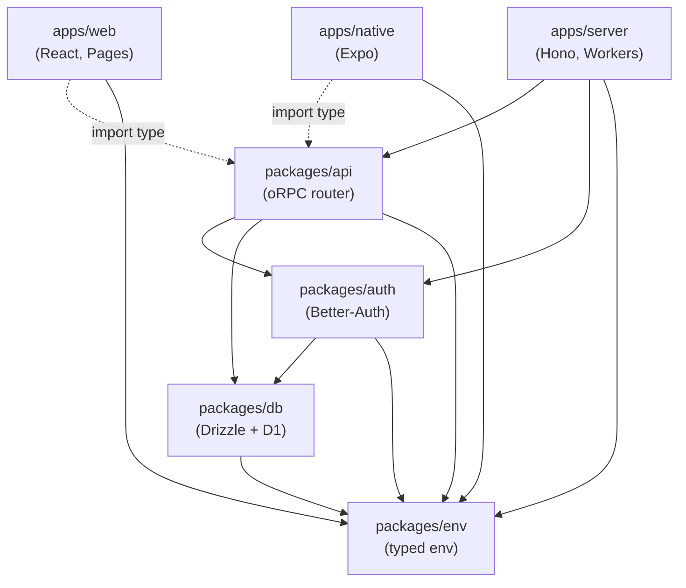
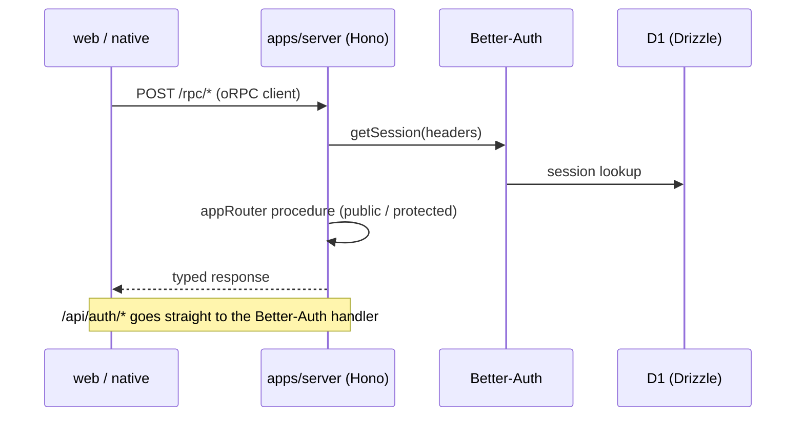

# han-monorepo-template

A full-stack TypeScript monorepo template: **React (web) + Expo (native) + Hono on Cloudflare Workers (API)**, sharing one type-safe oRPC contract end to end. Originally scaffolded with [Better-T-Stack](https://github.com/AmanVarshney01/create-better-t-stack), then extended with a unified toolchain, i18n, architecture lint, and a testing-trophy test suite.

## Stack

| Area                 | Choice                                                                                                  |
| -------------------- | ------------------------------------------------------------------------------------------------------- |
| Language / toolchain | TypeScript + [Vite+](https://viteplus.dev/) (`vp` — dev, build, lint, fmt, type check, test, git hooks) |
| Web                  | React 19, TanStack Start (SPA mode) + Router/Query/Form, HeroUI v3, Tailwind CSS v4                     |
| Native               | Expo + expo-router, HeroUI Native, Uniwind                                                              |
| API                  | Hono + oRPC (OpenAPI included) on Cloudflare Workers                                                    |
| Database             | Cloudflare D1 (SQLite) + Drizzle ORM                                                                    |
| Auth                 | Better-Auth (email/password, shared sessions across web & native)                                       |
| i18n                 | Lingui (en / ja / ko)                                                                                   |
| Tests                | Vitest via `vp test`, jest-expo, Playwright, Maestro — see [Testing](#testing)                          |
| Monorepo             | pnpm workspaces + Turborepo; boundaries enforced by a custom Oxlint plugin                              |

## Architecture

Package dependencies flow downward only (enforced by `vp check` — see `docs/agents/architecture.md`):



Client apps consume the oRPC router **as types only** — server code is never bundled into the clients.



## Quick Start

1. **Install the [Vite+](https://viteplus.dev/) CLI** (`vp`) — it manages the Node.js runtime and pnpm for you:

   ```bash
   curl -fsSL https://vite.plus | bash   # Windows: irm https://vite.plus/ps1 | iex
   ```

2. **Install dependencies and activate the git hooks**

   ```bash
   vp install
   vp config        # points core.hooksPath at .vite-hooks (pre-commit = vp check --fix)
   ```

3. **Create the D1 database** (first time only), then set `database_id` in `apps/server/wrangler.jsonc`:

   ```bash
   wrangler d1 create han-monorepo-template-db
   ```

4. **Generate and apply migrations**

   ```bash
   vp run db:generate
   vp run db:migrate:local    # local dev database (db:migrate:remote for production)
   ```

5. **Run the dev servers**

   ```bash
   vp run dev
   ```

   - Web: <http://localhost:3001>
   - API: <http://localhost:3000>
   - Native: Expo dev server (run via the Expo Go app or a dev build)

## Using as a template

1. Duplicate the repository.
2. Rename everything in one shot — package scope, wrangler/D1 names, Expo slug, deep-link scheme:

   ```bash
   vp run rename my-app
   ```

3. Follow the script's printed next steps (`vp install`, `vp check`, `wrangler d1 create`).

## Testing

The suite follows the [Testing Trophy](https://kentcdodds.com/blog/the-testing-trophy-and-testing-classifications) — integration tests are the bulk; details in `docs/agents/testing.md`.

```bash
vp run test                              # all unit/integration suites (Vitest + jest-expo via turbo)
vp run --filter ./apps/web test:e2e      # Playwright (first time: npx playwright install chromium)
vp run --filter ./apps/native test:e2e   # Maestro flows (requires a dev build on a simulator)
```

## Linting, Formatting, and Type Checks

[Vite+](https://viteplus.dev/) (`vp`) is the single toolchain; the pre-commit hook (managed by Vite+, `.vite-hooks/`) runs `vp check --fix` on staged files.

```bash
vp run check            # vp lint (Oxlint + tsgo type check + architecture rules) && vp fmt
```

## Deployment

### Web & API (Cloudflare via Wrangler)

- `apps/server` → Cloudflare Workers (`wrangler deploy`)
- `apps/web` → Cloudflare Pages (`wrangler pages deploy`)
- Deploy all: `vp run deploy`
- Server secrets: `wrangler secret put BETTER_AUTH_SECRET` (run in `apps/server`)

### Native (Expo / EAS)

EAS is not configured in the template — the EAS project ID is per-app, so set it up once after duplicating (run in `apps/native`):

```bash
npx eas init                          # link the app to an EAS project (writes projectId)
npx eas build --platform all          # store builds (or --profile development for dev clients)
npx eas submit --platform all         # App Store / Play Store submission
npx eas update                        # OTA updates for JS-only changes
```

CI/CD pipelines can be added later as EAS Workflows under `.eas/workflows/`.

## Project Structure

```text
han-monorepo-template/
├── apps/
│   ├── web/         # React + TanStack Start (SPA) → Cloudflare Pages
│   ├── native/      # React Native (Expo + expo-router)
│   └── server/      # Hono + oRPC → Cloudflare Workers
├── packages/
│   ├── api/         # oRPC router & procedures (the shared API contract)
│   ├── auth/        # Better-Auth configuration
│   ├── config/      # Shared tooling config (tsconfig base, Oxlint architecture plugin)
│   ├── db/          # Drizzle schema, migrations (D1)
│   ├── env/         # Typed environment variables (zod-validated)
│   └── evolution/   # Self-evolution gates (docs/skills invariants, CI guard) → docs/agents/self-evolution.md
├── docs/
│   ├── agents/      # Agent instructions (toolchain, architecture, testing, i18n, ...)
│   └── adr/         # Architecture decision records
├── CONTEXT-MAP.md   # Bounded-context map → per-context glossaries
└── scripts/rename.ts # One-shot project rename for template duplication
```

## Available Scripts

All `package.json` scripts run through `vp run` (alias: `vpr`).

| Script                                                 | What it does                                             |
| ------------------------------------------------------ | -------------------------------------------------------- |
| `vp run dev` / `dev:web` / `dev:server` / `dev:native` | Start all or one app in dev mode                         |
| `vp run build`                                         | Build all applications                                   |
| `vp run test` / `vp run test:e2e`                      | Unit & integration suites / E2E suites                   |
| `vp run check`                                         | Lint, type check, and format (`vp lint` / `vp fmt`)      |
| `vp run i18n:extract`                                  | Extract Lingui messages to `.po` catalogs (web + native) |
| `vp run i18n:check`                                    | Fail if `.po` catalogs are stale (used in CI)            |
| `vp run db:generate`                                   | Generate Drizzle migrations                              |
| `vp run db:migrate:local` / `db:migrate:remote`        | Apply D1 migrations                                      |
| `vp run deploy`                                        | Build and deploy web (Pages) + server (Workers)          |
| `vp run rename <name>`                                 | Rename the project after duplicating the template        |
